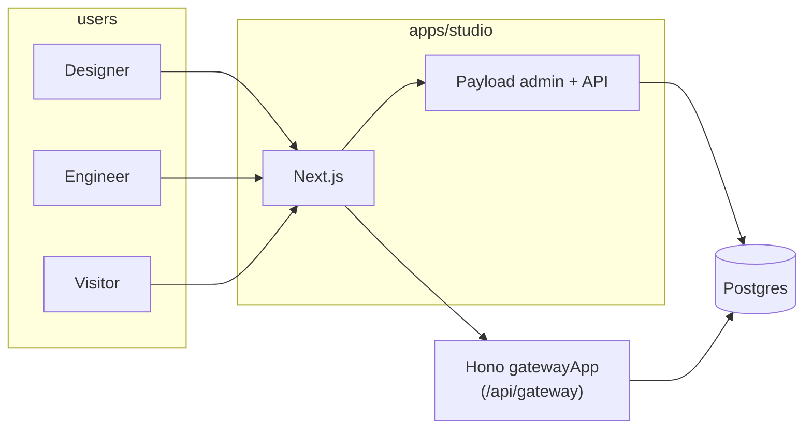

# App map (concise)

High-level map of the **contorro** monorepo: Payload + Next.js studio, Hono gateway mounted under `/api/gateway`, layered packages.

| Doc | Topic |
|-----|--------|
| [system-runtime.md](./system-runtime.md) | Apps, deployment shape, request path |
| [domain-layer.md](./domain-layer.md) | Kernel + `packages/domains/*` bounded contexts |
| [application-orchestration.md](./application-orchestration.md) | Application services + gateway + mutation entrypoints |
| [infrastructure-presentation.md](./infrastructure-presentation.md) | Payload config, persistence, contracts, UI, public render |

**Layer rules and monorepo boundaries:** repo root [`AGENTS.md`](../../AGENTS.md). This folder is the **feature/architecture map** aligned with what is implemented today.

Gateway handlers talk to Postgres (pool + `builder` schema via Drizzle where applicable) and application commands; they do not initialize Payload. Payload runs inside studio.
