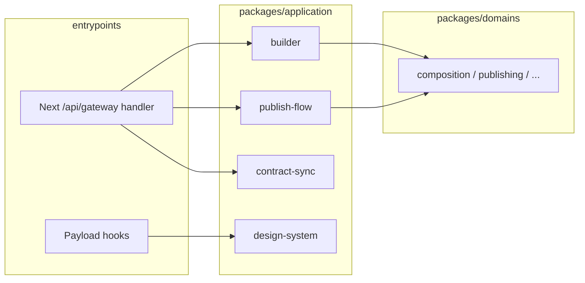

# Application layer & API

**Rule:** Gateway handlers and Payload hooks call **application** commands/queries — not domain aggregates directly.

## `packages/application/*`

| Package | Purpose (as implemented) |
|---------|---------------------------|
| `builder` | Designer builder: `addNode` / `removeNode` / `updateNodeProps` / `updateNodeStyle` / `saveDraft` / `submitForCatalog`; `getCompositionQuery`. Used by the gateway builder router with `DrizzleCompositionRepository`. |
| `publish-flow` | Page publish and rollback commands (`publishPageCommand`, `rollbackPageFromSnapshotCommand`); component revision workflow commands (`submit` / `approve` / `publish` / `rollback` / impact helpers). Gateway uses the revision commands with SQL adapters; page publish is available for Payload-side orchestration. |
| `contract-sync` | `parsePropSlotContractImport`; JSON Schema 2020 helpers (`propContractToJsonSchema2020`, `slotContractToJsonSchema2020`) for engineer-facing contract APIs. |
| `design-system` | Payload hook factories for design token sets and overrides (`createDesignTokenSet*` / `createDesignTokenOverride*`, validation). Consumed from studio/Payload wiring, not from the gateway package (gateway does not depend on it). |

## Gateway (`apps/gateway`)

Mounted under `/api/gateway` (see `apps/gateway/src/app.ts`). Routers:

| Mount | Auth middleware | Role |
|-------|-----------------|------|
| `/builder` | `designer-session` | Composition mutations + catalog submit + presence |
| `/contracts` | `engineer-session` | Read/update component definition contracts by key |
| `/publishing` | `designer-session` (per route) | Component revision submit / approve / publish / rollback / breaking-change acknowledge |

**Auth:** Payload session JWT is verified in gateway (`apps/gateway/src/runtime/auth.ts`, `jose`). Studio forwards the httpOnly token as `Authorization: JWT …` when the browser request has no `Authorization` header (`apps/studio/src/app/api/gateway/[[...route]]/route.ts`).

**Persistence in gateway:** Shared Postgres pool (`apps/gateway/src/runtime/db.js`) for raw SQL (catalog activity, presence, revision rows, contract rows) plus `createBuilderDb` / `DrizzleCompositionRepository` for `builder.compositions`.

### Builder routes (indicative)

Base path: `/api/gateway/builder`.

| Method | Path | Notes |
|--------|------|--------|
| `GET` | `/compositions/:id` | Load composition + `updatedAt` |
| `POST` | `/compositions/:id/nodes` | Add node |
| `DELETE` | `/compositions/:id/nodes/:nodeId` | Remove subtree |
| `PATCH` | `/compositions/:id/nodes/:nodeId` | Update props |
| `PATCH` | `/compositions/:id/nodes/:nodeId/style` | Update style token binding |
| `POST` | `/compositions/:id/draft` | Save draft (optimistic concurrency via `ifMatchUpdatedAt`) |
| `POST` | `/compositions/:id/submit` | Submit builder composition for catalog review |
| `GET` | `/compositions/:id/presence` | Other editors (soft lock / presence window) |
| `POST` | `/compositions/:id/presence` | Heartbeat |
| `DELETE` | `/compositions/:id/presence` | Release |

### Contracts routes

Base path: `/api/gateway/contracts`.

| Method | Path |
|--------|------|
| `GET` | `/components/:key/schema` |
| `POST` | `/components/:key/schema` |

### Publishing routes (component revisions)

Base path: `/api/gateway/publishing`.

| Method | Path |
|--------|------|
| `POST` | `/revisions/:id/submit` |
| `POST` | `/revisions/:id/approve` |
| `POST` | `/revisions/:id/publish` |
| `POST` | `/revisions/:id/rollback` |
| `POST` | `/revisions/:id/acknowledge-impact` |

Health: `GET /api/gateway/health` — Postgres `select 1`.

Some Payload hooks orchestrate persistence directly (e.g. builder mirror SQL in `payload-config`); prefer application commands for domain rules when adding new behavior.
