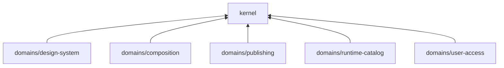

# Domain layer (`packages/domains/*`)

Domains hold **business rules + models**; depend on `packages/kernel` only. No imports between domain packages for business logic (ACL exception: `import type` only per repo rules).

## Packages (current workspace)

| Package | Responsibility |
|---------|----------------|
| `composition` | Composition tree invariants, graph mutations (`addChildNode`, `moveNode`, `removeSubtree`, …), validation, `CompositionRepository` port types, slot definitions from composition, `slotContractBreakingChanges`, `mergeSlotValuesIntoComposition` / slot substitution helpers |
| `design-system` | Tokens, primitives, style policies |
| `publishing` | Catalog / publish workflow rules (revision status, breaking changes, page publish guards — used by `publish-flow`) |
| `runtime-catalog` | Registered runtime components / contract surface |
| `user-access` | Roles, capabilities, surface permissions |

There is **no** `domains/content` package. Page body content is modeled as **Payload `pages`** (blocks, template slot values, relationships) plus **builder `PageComposition`** documents and the composition tree — enforced at the application/infrastructure boundary, not as a separate domain package.

## Kernel (`packages/kernel`)

`Result` / `AsyncResult`, `DomainError`, `EventBus` interface, branded IDs (`nanoid` only runtime dependency).

