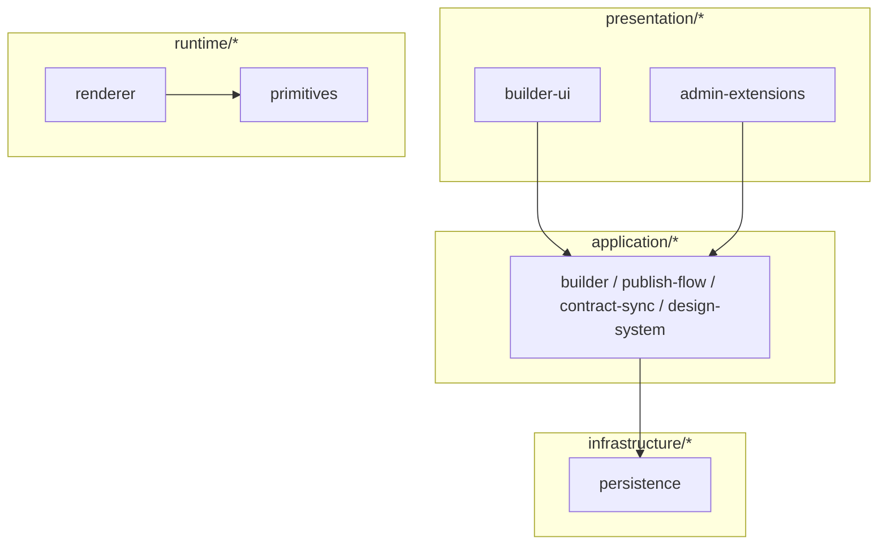

# Infrastructure, contracts, presentation, runtime

## Infrastructure (`packages/infrastructure/*`)

| Package | Role |
|---------|------|
| `payload-config` | Collections, globals, hooks; `buildBaseConfig` + `studio-config` assembly. Exports collections such as `Pages`, `PageCompositions`, `ComponentDefinitions`, `ComponentRevisions`, `Templates`, `DesignTokenSets`, `CatalogActivity`, `CompositionPresence`, etc. |
| `persistence` | `createBuilderDb`, Drizzle `builder` schema (`builder.compositions`, …), `DrizzleCompositionRepository` implementing the composition repository port |
| `event-bus`, `blob-storage`, `cache`, `telemetry` | Packages exist for adapters; wire-up is feature-specific |

**Rule:** `@payload-config` alias is **Next.js-only** (`apps/studio`); shared `packages/*` must not use it.

## Contracts (`packages/contracts/*`)

- `zod` — `PageCompositionSchema`, node/prop/slot contracts, `EditorSlotContractSchema`, `normalizeSlotContract` / `parseEditorSlotContract`, design-token shapes, etc.
- `json-schema` — JSON Schema generation used by contract-sync / gateway export

## Config (`packages/config/*`)

- `env` — Zod-validated env per app (including gateway)
- `tailwind` — token compilation (`compileTokenSet`); used on public pages with published token sets

## Presentation (`packages/presentation/*`)

| Package | Role |
|---------|------|
| `builder-ui` | Designer canvas, catalog, inspector, draft bar, Zustand `builder-store` (`BuilderApp`, …) |
| `admin-extensions` | Payload admin UI extensions |
| `preview-ui` | Shared preview |
| `shared` | Shared UI utilities (e.g. store helpers) |

**Rule:** presentation **must not** import `packages/infrastructure/*` directly.

**Studio-only UI** (examples): custom admin fields under `apps/studio/src/components/admin/` (e.g. designer slot values, template slot fields) that bridge Payload documents to composition concerns.

## Runtime (`packages/runtime/*`)

| Package | Role |
|---------|------|
| `renderer` | `renderComposition` — React tree for published composition |
| `primitives` | Default primitive registry for renderer |
| `code-components` | Engineer-registered runtime components |

Public site route `apps/studio/src/app/(frontend)/[slug]/page.tsx` loads `pages`, merges template slot values into the composition when present, renders designer content blocks and/or the composition tree with compiled token CSS variables.

`payload-config` (collections/hooks) lives alongside `persistence` (Drizzle builder repo); both target the same Postgres database from studio/gateway. Studio wires Payload + gateway + presentation; the frontend page imports `@repo/runtime-renderer` and `@repo/runtime-primitives` directly.
