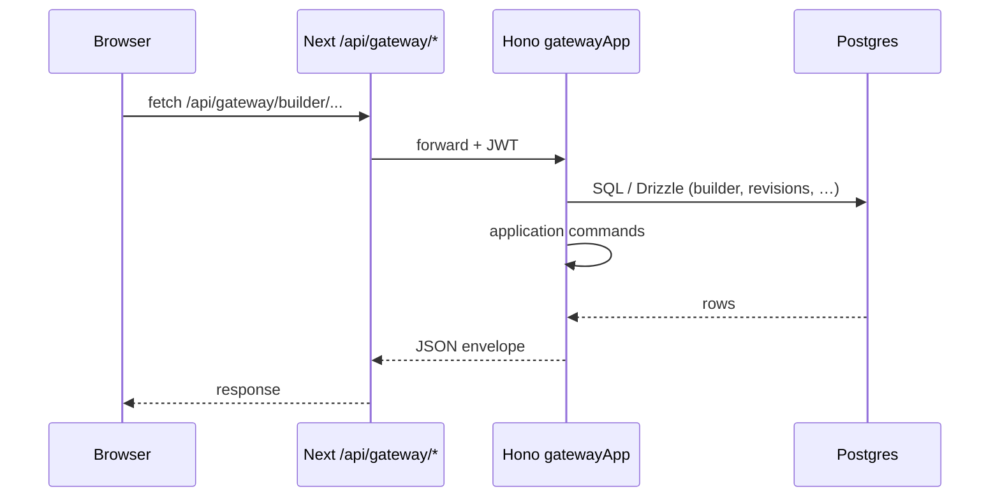

# System & runtime

## Apps

| App | Role |
|-----|------|
| `apps/studio` | Next.js: `(frontend)` public routes, `(payload)` admin, `payload.config.ts`, API route that runs `gatewayApp.fetch` for `/api/gateway/*` |
| `apps/gateway` | Hono `gatewayApp` (`@repo/gateway/app`): builder, contracts, publishing — **Postgres + application packages**; JWT auth for designer vs engineer surfaces |

**Migrations** run from **`apps/studio` only** (Payload CLI). The gateway uses the same Postgres database and `POSTGRES_URL` (or equivalent) but does not run Payload migrations.

**Local dev:** root `pnpm dev` runs studio and the standalone gateway watcher (`pnpm --filter @repo/gateway dev`). Browser traffic for `/api/gateway/*` is still handled by Next’s route handler, which invokes the in-process `gatewayApp` (see `apps/studio/src/app/api/gateway/[[...route]]/route.ts`).

## Same-origin gateway

Studio forwards the Payload session cookie to `Authorization: JWT …` when needed so gateway middleware can verify the same JWT as admin (`jose` + `PAYLOAD_SECRET` in gateway env).

Gateway does **not** call Payload Local API in these handlers; Payload continues to own documents and runs inside studio.

## External (typical prod)

- Postgres (e.g. Neon pooled)
- Optional: blob, telemetry — via infrastructure adapters and env
