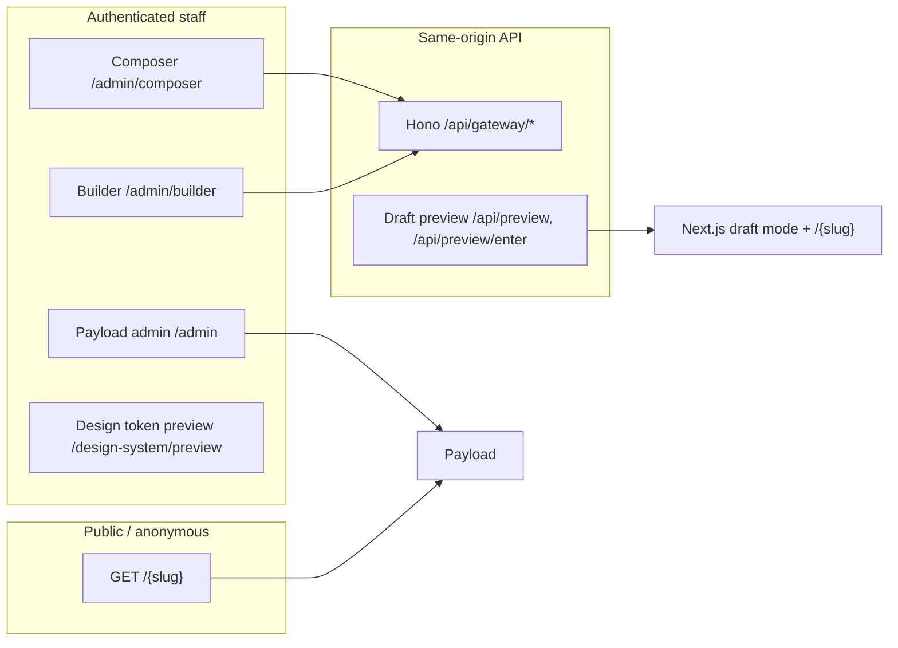
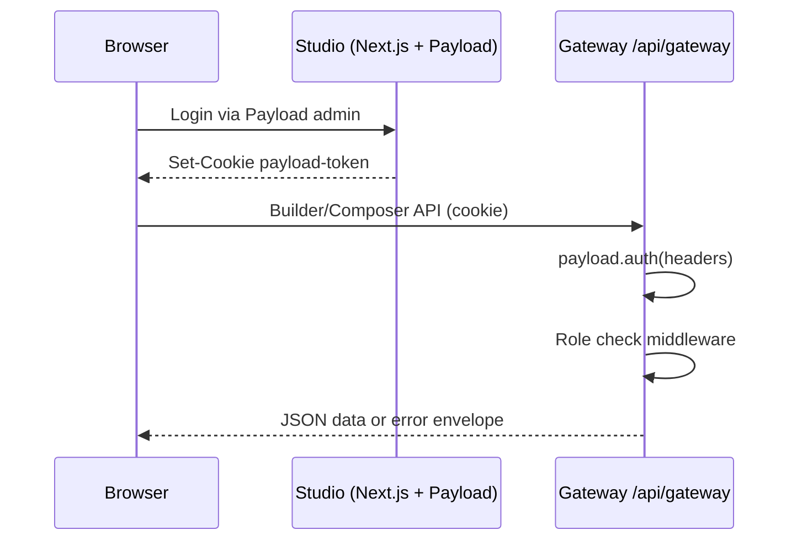
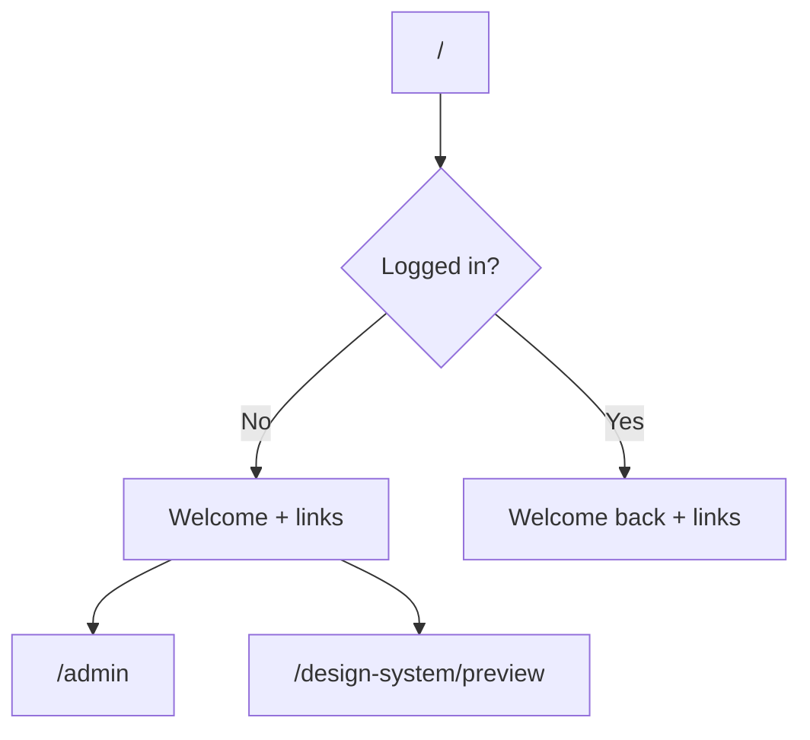
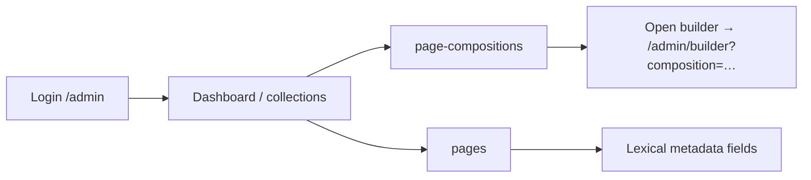
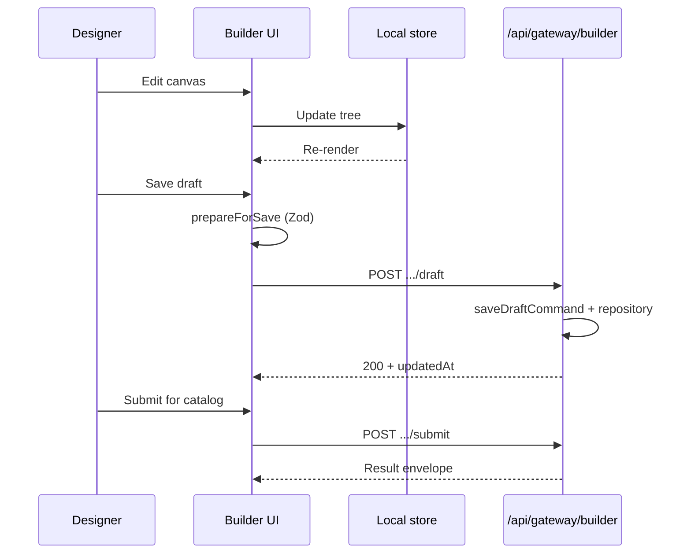
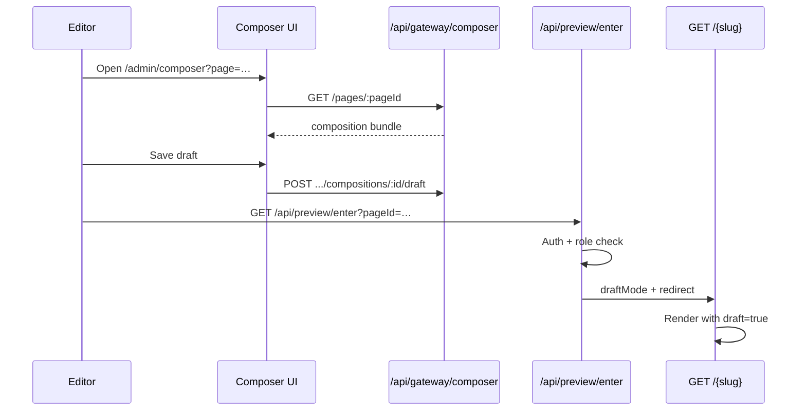
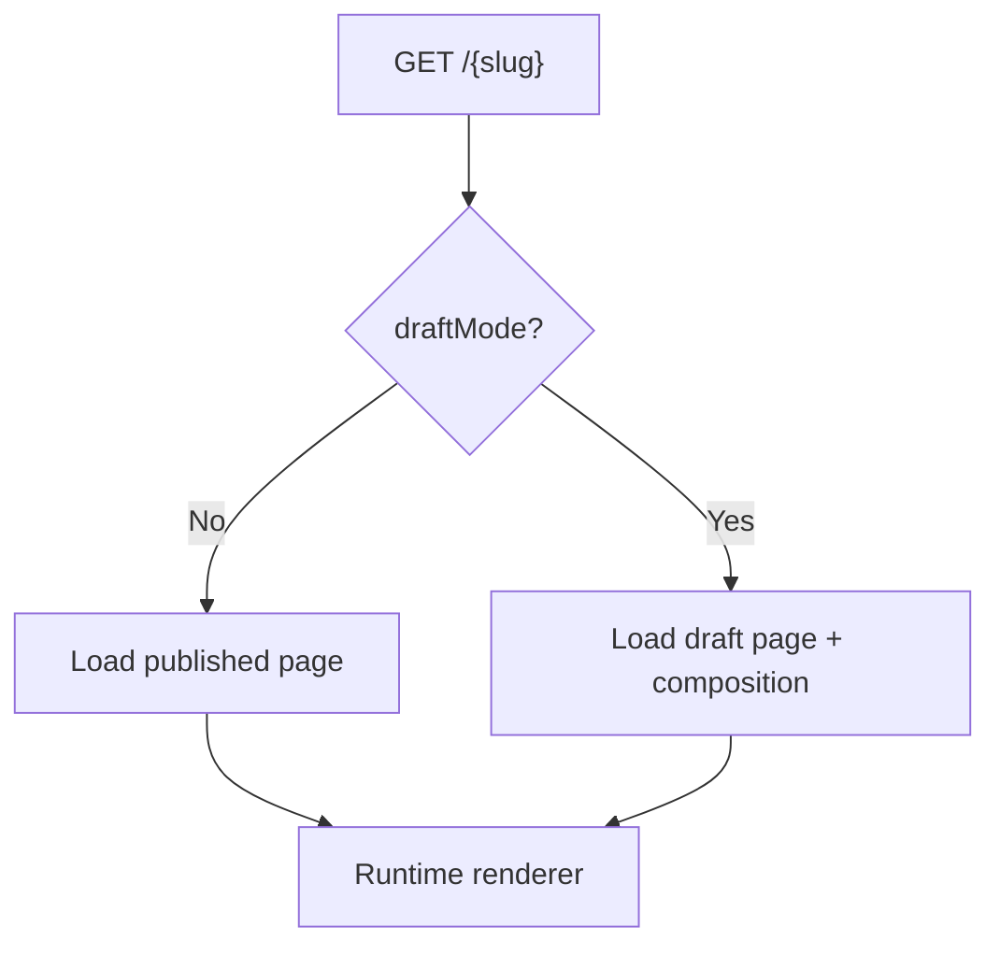
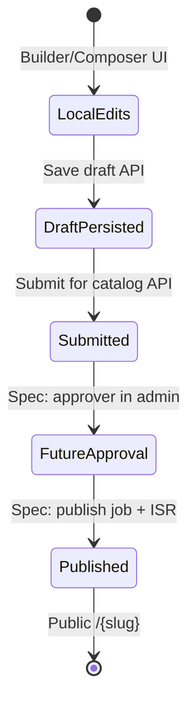

# User workflows and product journeys

**Purpose:** Map the main **human-visible flows** in the Contorro studio app today, aligned with [`docs/architecture-spec.md`](architecture-spec.md). Use this as a single place to see **who does what, on which surface, and which HTTP paths are involved**.

**Scope:** Covers `apps/studio` (Next.js + Payload admin + public routes), the embedded Hono gateway under `/api/gateway/*`, and how they connect to presentation packages (`builder-ui`, `composer-ui`). Spec-only or not-yet-wired APIs are called out explicitly.

---

## 1. Product framing (from the architecture spec)

The platform is a **multi-surface authoring system**: Payload provides auth, collections, drafts, and the admin shell; the **visual builder** and **page composer** are product surfaces on top. The architecture spec defines three primary personas:

| Persona | Primary surface | Role in the codebase |
|--------|-----------------|----------------------|
| **Designer** | Visual builder canvas | `builder-ui`, gateway `/api/gateway/builder/*`, admin view `/admin/builder` |
| **Content editor** | Page composer | `composer-ui`, gateway `/api/gateway/composer/*`, admin view `/admin/composer` |
| **Engineer** | Contracts / runtime registry | Represented in RBAC (`engineer` role); **no dedicated engineer UI flow** is wired in the current app beyond Payload admin and shared collections |

---

## 2. Audit: what exists in the app today

### 2.1 Surfaces and entry URLs

| Surface | How users open it | Notes |
|---------|-------------------|--------|
| **Marketing / home** | `GET /` | Greets the user; links to admin and design token preview. |
| **Payload admin** | `GET /admin` (and deep links into collections) | Login, CRUD on all collections, Lexical for metadata fields where defined. |
| **Visual builder** | `GET /admin/builder?composition=<id>` | Custom admin view; also “Open builder” from a **page composition** document. Nav link visible to **admin** and **designer** only. |
| **Page composer** | `GET /admin/composer?page=<pageDocumentId>` | Custom admin view; **Composer** nav link for **admin**, **designer**, **contentEditor**. Requires `page` query param. |
| **Public page render** | `GET /{slug}` | Server-rendered composition via runtime renderer; respects **published** vs **draft** based on Next.js draft mode. |
| **Design token preview** | `GET /design-system/preview` | Shows compiled tokens from a published token set (or empty state with guidance). |
| **Gateway (machine API)** | `/api/gateway/*` | Implemented in `apps/gateway`, mounted from `apps/studio` via `gatewayApp.fetch`. |

### 2.2 Gateway endpoints (implemented)

The running gateway (`apps/gateway/src/app.ts`) exposes:

- `GET /api/gateway/health` — DB reachability check.
- **`/api/gateway/builder/*`** — Composition mutations behind **designer session** middleware (`admin` or `designer` only): load composition, add/remove/update nodes, style updates, **save draft**, **submit for catalog**.
- **`/api/gateway/composer/*`** — `GET /pages/:pageId` loads composer editor state; the **same mutation routes** as builder, behind **composer session** middleware (`admin`, `designer`, or `contentEditor`).

Shared mutation shape is implemented in `apps/gateway/src/routes/composition-mutations.ts` (used for both builder and composer bases).

### 2.3 Preview and draft viewing

| Mechanism | Route | User |
|-----------|-------|------|
| **Secret-based preview (spec pattern)** | `GET /api/preview?secret=…&slug=…` | Uses `PREVIEW_SECRET`; enables Next.js draft mode and redirects to `/{slug}`. Intended for Payload `admin.preview` URL on the **pages** collection. |
| **Authenticated preview entry** | `GET /api/preview/enter?pageId=…` | Validates Payload session and compose-capable roles, then enables draft mode and redirects to `/{slug}`. Avoids exposing the preview secret to clients (see route comments). |

Public slug route `apps/studio/src/app/(frontend)/[slug]/page.tsx` uses `draftMode()` and Payload `draft` / `overrideAccess` so that **draft mode** shows draft page + composition data; otherwise only **published** documents match anonymous expectations per page read access.

### 2.4 Architecture spec vs codebase (gap summary)

The architecture spec lists additional gateway groups (**catalog**, **contracts**, **publishing**). Those routers are **not** mounted in `apps/gateway/src/app.ts` today. The **end-to-end sequence** in the spec (approval, publish job, ISR) describes the **target** lifecycle; the **live implementation** currently centers on **admin + builder/composer + slug renderer + draft preview**, not the full publishing pipeline UI.

---

## 3. Roles and gating (cross-cutting)

Users are authenticated via **Payload JWT in HTTP-only cookies** (same-origin to the gateway). Role is a single `role` field on the user (`admin`, `designer`, `contentEditor`, `engineer`).

| Capability | Where enforced | Roles |
|------------|----------------|-------|
| Open **Builder** nav | `BuilderNavLink.tsx` | `admin`, `designer` |
| Open **Composer** nav | `ComposerNavLink.tsx` | `admin`, `designer`, `contentEditor` |
| Gateway **builder** mutations | `designer-session.ts` | `admin`, `designer` |
| Gateway **composer** load + mutations | `composer-session.ts` | `admin`, `designer`, `contentEditor` |
| Preview enter | `api/preview/enter/route.ts` | Same as composer-capable roles |
| **Pages** read on public site | `pagesReadAccess` | Anonymous: `_status === published`; authenticated: broader read |

---

## 4. Journey A — Visitor or logged-in user on the home page

**Goal:** Land on the product, optionally discover admin or the token preview.

1. User opens `/`.
2. Server resolves session (optional); UI shows welcome copy and links.
3. Links: **Admin**, **Design token preview** (`/design-system/preview`), external docs.

---

## 5. Journey B — Staff: sign in and use Payload admin

**Goal:** Manage users, pages, page compositions, design system globals, and other collections defined in `packages/infrastructure/payload-config`.

1. User opens `/admin`, signs in.
2. User navigates collections (e.g. **Pages**, **Page Compositions**, **Design Token Sets**).
3. **Lexical** fields on pages are for **metadata** (SEO, social), not visual body copy — per architecture spec boundary between Lexical and composition tree text.

**Custom admin affordances:**

- After nav: **Builder** and **Composer** links (role-gated).
- **Page composition** edit view: control to open the **visual builder** in a separate admin view with `composition` query param.
- Dashboard may show **design system preview** callout (re-exported admin extension).

---

## 6. Journey C — Designer: visual builder

**Goal:** Author and style a **page composition** structurally; persist drafts and optionally submit for catalog (API exists; broader catalog workflow may be spec-ahead).

### 6.1 Entry

- Sidebar: **Builder** → `/admin/builder` (typically needs `?composition=<pageCompositionId>`).
- From **Page compositions** document: **Open builder** injects the same query param.

### 6.2 In-session behavior (product-level)

1. **Canvas** reflects local state (Zustand); changes are immediate in memory.
2. **Save draft** validates with shared `prepareCompositionForSave` / Zod contract, then `POST /api/gateway/builder/compositions/:id/draft`.
3. Structural edits use node APIs: add/remove node, patch props, patch style token.
4. **Submit** calls `POST /api/gateway/builder/compositions/:id/submit`.

### 6.3 System flow

**Mental model:** Until **save draft**, nothing is durable for other users. The architecture spec emphasizes Zustand as **local-only** until persistence.

---

## 7. Journey D — Content editor (or designer): page composer

**Goal:** Edit page-level composition content in a constrained editor, save drafts, and preview the public route with drafts.

### 7.1 Entry

- Sidebar: **Composer** → `/admin/composer` (must add `?page=<pagesCollectionDocumentId>` — the UI explains this if missing).
- Often users arrive from **Pages** collection with a bookmarkable URL including `page`.

### 7.2 Load and save

1. `ComposerApp` loads state via `GET /api/gateway/composer/pages/:pageId` (returns page summary + composition + `updatedAt`).
2. Edits update local composer store; **Save draft** posts to `POST /api/gateway/composer/compositions/:id/draft` (same body contract as builder).

### 7.3 Preview

- **From Payload preview button** (pages collection): configured URL hits `/api/preview?secret=…&slug=…` (requires `SITE_URL` + `PREVIEW_SECRET`).
- **Authenticated path:** `/api/preview/enter?pageId=…` enables draft mode and redirects to `/{slug}` so the user sees the same renderer as the public site, with draft content.

---

## 8. Journey E — Anonymous visitor: published page

**Goal:** View the live site for a slug when the page is **published**.

1. `GET /{slug}` loads the **pages** document (no draft mode).
2. Access control restricts anonymous reads to **`_status` published**.
3. Related **page composition** is loaded; tree is validated with `PageCompositionSchema`, tokens compiled, `renderComposition` produces React output.

---

## 9. Journey F — Design system: token preview

**Goal:** Inspect compiled **@theme** output from the published default (or first published) token set.

1. User opens `/design-system/preview` (also linked from home).
2. If no token set: empty state with instructions referencing **Globals** and **Design Token Sets** in admin.
3. If tokens exist: shows compiled CSS variables and sample UI tied to tokens.

This supports the **designer** and **engineer** mental model of verifying tokens before they flow into rendered pages (slug route loads published token set for preview in a similar way).

---

## 10. End-to-end lifecycle (spec vision vs current building blocks)

The architecture spec describes a longer pipeline: **draft → submit → review → approve → publish job → revalidation**. The repository already contains **save draft**, **submit** at the gateway, and **versioned** Payload documents; **dedicated gateway routes for catalog promotion, contract import/export, and publishing actions** listed in the spec are **not** all present in `gatewayApp` yet.

Use this diagram to separate **what users can do today** (left side) from **planned orchestration** (right side).

---

## 11. Miscellaneous routes

| Route | Purpose |
|-------|---------|
| `GET /api/gateway/health` | Operational check |
| `GET /my-route` | Example scaffold in the studio app |
| `POST /api/users/login` (Payload) | Authentication (standard Payload) |

---

## 12. How to keep this document accurate

- When adding gateway routers, update **section 2** and the **gap** paragraph.
- When adding admin views or public routes under `apps/studio/src/app`, update **section 2.1** and the relevant journey.
- When changing preview behavior, update **section 7.3** and **section 8** together so draft vs published stays consistent.

Primary normative reference: [`docs/architecture-spec.md`](architecture-spec.md) (product framing, gateway, preview strategy, auth).
